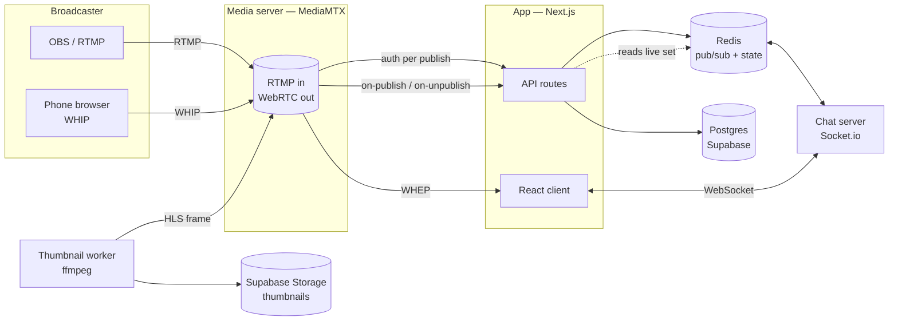

# Live Stream MVP

A short-form **vertical live streaming** platform — TikTok-style swipe discovery, sub-second
latency video, real-time chat, and tipping with a real payout pipeline.

> **Status: in progress.** Streaming, discovery, chat, tipping, follows, search, and moderation
> all work end to end on a local stack. Deployment, integration testing, and the payout
> provider integration are **not** finished. See [Where this actually stands](#where-this-actually-stands).

<p align="center">
  
</p>

<p align="center"><em>Swiping between five concurrently live streams. Each is a real WebRTC session.</em></p>

---

## The three things this is built around

Everything in this repo is judged against these. If a feature doesn't serve one of them, it doesn't ship.

1. **Video that doesn't break.** Sub-second latency, automatic reconnection, no dead-end states.
2. **Vertical short-form discovery.** 9:16 full screen, swipe to the next stream, playing immediately.
3. **Tipping and interaction.** Low-latency chat, tips that land on screen instantly, moderation
   that actually stops people.

---

## What it looks like

| Feed | Tipping | Discovery |
|---|---|---|
|  |  |  |
| Live WebRTC playback, overlay, and chat in one screen | Tip alert overlays the stream and posts to chat in the same moment | Category chips with live counts, plus trigram search |

| Creator dashboard | Chat moderation | Report queue |
|---|---|---|
|  |  |  |
| RTMP endpoint plus stream key, with an OBS walkthrough | Slow mode, followers-only, blocked words, ban list | Reports grouped by target, ranked by how many distinct people reported |

**Bilingual (Korean / English), switched without a reload:**

<p align="center">
  
  
</p>

---

## Architecture

The app server and the media server are separate from day one, and the app server is stateless —
all shared state lives in Redis or Postgres.



**Why the pieces are split this way**

- **Media server separate from the app server.** Video scales on completely different axes than
  API traffic. Keeping them together means one bad transcode takes down login.
- **Chat as its own process.** It holds long-lived connections; the app server should stay
  request-scoped and disposable.
- **Redis as the shared substrate.** Live-stream set, viewer counts, rate limits, and ban cache
  all live there, so adding a second app or chat server needs no coordination code.
- **Thumbnail worker as a separate process.** `ffmpeg` is heavy. Inside a Next.js route it would
  slow every API request that happens to share the box.

---

## Engineering decisions worth reading

These are the calls where the obvious approach turned out to be wrong.

### HLS was 13 seconds behind. WebRTC got it under one.

The first version used low-latency HLS. Tuned as far as it would go, glass-to-glass latency was
still ~13s, which makes chat and tipping feel broken — viewers react to something the streamer
finished doing ten seconds ago. Switching playback to **WebRTC via WHEP** brought it under a
second. The HLS path is still there and still remuxing, because the thumbnail worker reads
frames from it (MediaMTX has no snapshot API, and enabling RTSP would have meant changing the
media config).

### The feed must never dead-end — but looping silently is worse than stopping

When you'd watched every live stream, swiping did nothing. No bounce, no message —
which reads as a broken app, not as "that's all there is". The Following tab was worse:
it returns `has_more: false` unconditionally, so it dead-ended after two or three streams,
**and it always will**, at any scale. Running out isn't a small-platform problem; it's a
narrow-slice problem.

The fix is a slot, not a loop. `FeedEndCard` occupies the position after the last stream,
and that position is where 24-hour posts will land later — "what follows live" is the
durable structure; re-showing streams is a temporary occupant.

Re-showing a live stream is defensible in a way that re-showing a photo is not: the
streamer is doing something different now. But **only the system knows that.** A viewer
who silently sees the same name again reads it as a duplicate or a bug, so the card says
what's happening before anything repeats. Repeats are ordered by how long you actually
watched each one this session, capped at three passes, and only when at least three
streams are live — cycling between two is transparently a loop.

On the Following tab it does not continue into recommendations. That tab is a filter the
viewer chose; the card offers the switch and leaves the decision to them.

Repeat views send **no** signals. Impressions and dwell from a second pass would inflate
that stream's taste score, and that score is the next feed's ordering — a bias the app
builds against itself.

<p align="center">
  
</p>

### Two balances, because one balance is a money-laundering machine

Users have `point_balance` (bought with a card, spendable only on tips) and `revenue_balance`
(received from tips, withdrawable only via payout). They never mix.

With a single balance, "top up with a stolen card → tip your alt account → cash out" is a clean
card-cashing loop. If the platform fee is cheaper than the going rate for card laundering, people
*will* find it, and since it takes exactly two accounts, after-the-fact detection can't catch it.
So `send_donation` debits the sender's **purchased** points and credits the receiver's **revenue**
points, in one transaction. Payout can only ever touch revenue.

### Notifying followers inside the publish webhook broke popular streamers

When a stream goes live, MediaMTX calls `on-publish` and waits for the response. The first
version looped over the streamer's followers and sent notifications inside that handler. The more
followers someone had, the longer the webhook took — until MediaMTX timed out and treated it as a
failed publish. **The more popular you were, the less able you were to go live.**

Now `on-publish` pushes one event onto a Redis channel and returns immediately. The chat server
consumes it and pages through followers 1,000 at a time.

### Redis is a cache; Postgres is the truth

Chat bans are checked on every message, so they're cached in Redis with a TTL that doubles as
timeout expiry (no cron needed). On a cache miss the server reads Postgres and repopulates.

The inverse — treating Redis as authoritative — means every permanent ban silently lifts the next
time Redis restarts or evicts. "No ban" is cached too, for 60 seconds, otherwise every message
from every ordinary user is a cache miss and a database round trip.

### Ending a stream means kicking the publisher, not updating a row

The first version of admin force-stop set `status = 'ended'`. The stream vanished from listings —
and kept broadcasting to anyone holding the URL. Force-stop now finds the publisher's connection
in MediaMTX (per protocol: `rtmpconns`, `webrtcsessions`, `rtspsessions`, `srtconns`) and kicks it
**before** touching the database. The other order produces a stream that reads as "ended" while
still going out.

### Signals are split by whether they can be forged

Feed ranking data is collected from two places on purpose:

| Signal | Source | Why |
|---|---|---|
| impression, dwell time, skip | client → `/api/signals` | Forging it only corrupts your own feed |
| follow, tip | server-side only | Forging it would push someone else's stream up everyone's feed |

Dwell time is capped at 5 minutes in both the API and a database `CHECK`, and is used **only**
for ranking — never for payouts. The moment view time pays money, bots show up.

### Categories are a fixed list; tags are free text

Category used to be a free-text field. One typo splits a category in two, and once that happens
both the browse chips and the taste-scoring axis are meaningless. Categories are now a closed set
with stable IDs; the long tail moved to `tags` (free text, max 5).

The category ID is what goes in the database *and* what keys the taste score, so it never changes
and is never translated — only its display label is.

<p align="center">
  
</p>

### Korean full-text search needs trigrams, not tsvector

Postgres `tsvector` has no Korean dictionary, so it can't segment morphemes — searching "게임"
would not match "게임방송". `pg_trgm` does partial matching without a dictionary, which makes it
strictly better here. Search results are split into **streamers / streams / categories** rather
than one blended relevance list, because people are overwhelmingly looking for a specific person.

### The stream path is public; only the key is secret

The MediaMTX path is the stream's UUID, and it appears in every viewer's WHEP URL. Publish
authorization is delegated to `POST /api/stream/auth`, which validates the stream key supplied as
the RTMP/WHIP password in constant time. This is also the **only** enforcement point for account
suspension — without that check, a suspended streamer just presses "go live" again.

A consequence worth being honest about: because playback URLs carry no secret, there is no way to
block someone from *watching*. So the moderation sheet says so explicitly — "this only restricts
chat, they can still watch" — instead of implying a guarantee the architecture can't keep.

### `NULL` means "not suspended", so indefinite is the year 9999

`suspended_until = NULL` has to mean "not suspended". An indefinite suspension is stored as
`9999-12-31`. Postgres `'infinity'` was the obvious choice and is wrong: it arrives in JavaScript
as `Invalid Date`, every comparison against it returns false, and the suspension silently
evaporates.

### Localization: cookie, not URL prefix — and the server never sends sentences

Locale is resolved from a cookie, falling back to `Accept-Language`. There is no `/en/...` path
segment, so shared links and Open Graph metadata stay on one canonical URL.

More interesting: **the chat server sends event codes, not rendered text.** A single stream can
have viewers reading in different languages, so a server that formats `"{nickname} joined"` picks
one language for everybody. It emits `{ event: 'joined', nickname }` and each client renders it
in its own locale. The same rule applies to report reasons and stream categories — a stable code
goes in the database, the display string is looked up per locale. Category IDs are also the keys
for taste scoring, so translating them would corrupt the ranking data.

---

## Stack

| Layer | Choice |
|---|---|
| Frontend | Next.js 16 (App Router, Turbopack), React 19, TypeScript strict, Tailwind 4 |
| Backend | Next.js API routes (32 routes), designed to split out later |
| Media | MediaMTX — RTMP/WHIP in, WebRTC (WHEP) out, LL-HLS retained for thumbnails |
| Realtime | Socket.io on its own process, Redis pub/sub adapter for multi-instance |
| Database | Supabase Postgres, 11 migrations, RLS with column-level grants |
| Payments | Stripe Checkout (top-ups), Toss payouts (withdrawals — pending approval) |
| Storage | Supabase Storage (auto-generated thumbnails) |
| i18n | next-intl, cookie-based locale, 315 message keys in ko/en |

Roughly 13,500 lines across 126 TypeScript files, organized by domain
(`auth`, `stream`, `chat`, `donation`, `user`, `feed`, `moderation`, `payout`).

---

## Where this actually stands

### Working end to end

- ✅ Auth, profiles, follows, live notifications
- ✅ RTMP (OBS) and WHIP (phone browser) publishing, with per-publish authorization
- ✅ Sub-second WebRTC playback, automatic reconnect, adaptive object-fit
- ✅ Swipe feed with preconnect + thumbnail placeholders on inactive items
- ✅ Real-time chat: Redis-backed rate limiting, slow mode, followers-only, blocked words
- ✅ Tipping: Stripe top-up, idempotent webhook crediting, tiered on-stream alerts
- ✅ Search (pg_trgm) and category browsing, with taste signals being collected
- ✅ Moderation (timeouts, bans, message deletion) and an admin report queue
- ✅ Auto thumbnails, Open Graph metadata for shared links
- ✅ Korean / English UI with in-app switching

### Not done

- ⬜ **Deployment.** Nothing is deployed. Vercel + EC2 is planned; the Docker/WebRTC UDP issue
  needs verifying on Linux first.
- ⬜ **Integration testing.** No E2E suite. Verified by hand plus two regression scripts
  (21 security checks, 46 payout checks).
- 🔄 **Payouts.** Code, schema, and UI are complete and the fee math is verified, but the Toss
  sub-payment service is still pending approval, so **seller registration and a real payout round
  trip have never run**. The UI shows a "not configured" banner rather than pretending otherwise.
- ⬜ **Design pass.** Feed and chat are functionally complete but visually unfinished — this is
  known and deliberate; correctness came first.
- ⬜ **Web Push.** Live notifications work in-app only. Push while the app is closed needs a
  service worker, VAPID keys, and a subscription table.
- ⬜ **VOD and clips.** Table stubs exist; nothing is recorded.

<p align="center">
  
</p>

<p align="center"><em>The payout screen states the unfinished dependency instead of hiding it.</em></p>

### Known gaps in the localization pass

Deliberately scoped: UI strings, category labels, report reasons, and chat system messages are
localized. **API error messages and chat error toasts are still Korean only** — they surface as
strings from the server, and doing them properly means returning error codes and translating
client-side. That's the right fix; it just hasn't been done yet.

---

## Running it locally

Requires `mkcert`, `ffmpeg`, `mediamtx`, Docker, and the Stripe CLI (all available via Homebrew).

```bash
pnpm install
pnpm certs:dev     # issues dev TLS certs and refreshes the LAN IP in .env.local
pnpm dev:all       # Next.js + chat server + Redis (Docker) + MediaMTX + Stripe listener
```

Then open <https://localhost:3000>.

**HTTPS is not optional here.** `getUserMedia` requires a secure context, and an HTTPS page can't
POST to an `http://` WHIP endpoint without being blocked as mixed content — so the app (3000),
chat (3001), and media (8891) all run TLS from one shared mkcert certificate. `pnpm dev:http`
exists but silently breaks phone broadcasting.

### Demo data

The screenshots above are not mockups — they're this stack running with generated broadcasters.

```bash
npx tsx scripts/seed-demo.ts          # demo streamers, streams, and reports
bash scripts/demo-broadcast.sh start  # ffmpeg pushes 9:16 test video over RTMP
npx tsx scripts/demo-chat.ts --first  # demo accounts join and chat

bash scripts/demo-broadcast.sh stop
npx tsx scripts/seed-demo.ts --clean
```

The demo streams authenticate through the real `/api/stream/auth`, trigger the real `on-publish`
webhook, and land in the same Redis live set the feed reads. Nothing is stubbed.

### Verification

```bash
pnpm verify:security   # 21 checks — RLS, column grants, key exposure, media config
pnpm verify:payout     # 46 checks — fee invariants, JWE round trip, DB payout functions
```

`verify:security` needs the dev stack running. `verify:payout` runs without any Toss credentials.

---

## Repository notes

[`docs/ENGINEERING-LOG.md`](docs/ENGINEERING-LOG.md) is the log of what actually went wrong here
and what turned out to be causing it — only entries with a confirmed cause, including the ones
still open. A camera that answered "done" while returning the opposite orientation, an
`IntersectionObserver` that fires again on re-observe, a tip button that rendered perfectly and
could not be clicked.

Comments in the code explain **why**, not what. Where a decision is easy to accidentally revert,
the comment says so — several of these were found twice because the second reader didn't know
why the first fix looked odd.
